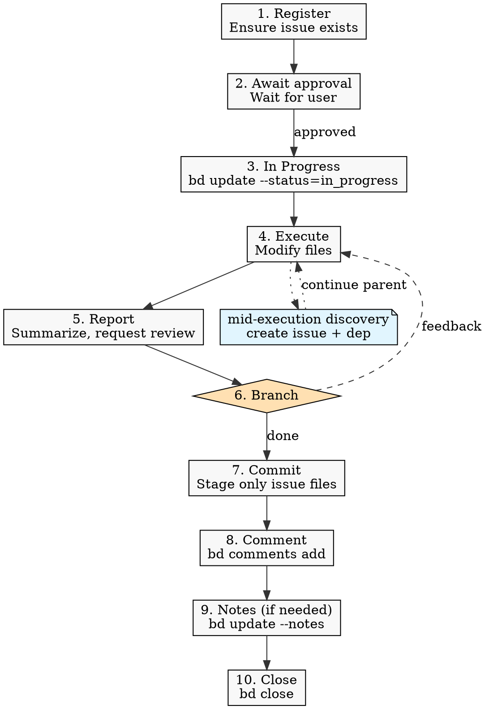

# Beads Workflow

Project-specific beads workflow conventions for any file-modifying task.

## Initialization

Before any workflow step below, verify `.beads/` exists at the repository root. If it does not, the repo has not been initialized — invoke `/bds-setup` to install bd and run the init flow, then resume.

## Agent Workflow

Every file-modifying task, including trivial doc edits, follows these 10 steps:

1. **Register** — ensure a beads issue exists (create if needed, or confirm an existing one covers the scope). See [issue-content.md](issue-content.md) for description rules.
2. **Await approval** — do not start until the user approves. Multiple pre-registered issues may be approved together.
3. **In progress** — transition before touching any file.
4. **Execute.**
5. **Report** — summarize changes and request confirmation. If the description contains a verification section (e.g., `## Verification`), execute every item and include the outcomes; never announce `done` while any verification item is still outstanding.
6. **Branch on response** — `done` → step 7. Anything else is feedback; return to step 4 (status stays `in_progress`).
7. **Commit** — stage only files for this issue and commit. Never run `git push`. See [commit-rules.md](commit-rules.md).
8. **Comment** — include the commit hash and subject line.
9. **Notes** — record durable context not already captured in the diff, commit, or comment. **Required when step 6 feedback modified the recorded decision**, using the matching prefix so the two cases stay separable later:
   - `Added via feedback: <item>. Commit: <hash>` — scope was added while METHOD itself stayed intact.
   - `Decision changed: 
. Commit: <hash>` — METHOD itself was revised (decision reversal). Also update the issue's `### Alternatives Considered` from step 1.
10. **Close** — close the issue with a reason.

**Session signals:** only `approved` (step 1→3) and `done` (step 6→7) carry workflow meaning.

For bd command examples used in each step, see [commands.md](commands.md).
For shell-quoting safety when calling `bd` with narrative args, see [shell-safety.md](shell-safety.md).

## Operating Mode

Local-only shared-server (no Dolt remote). Do **not** run `bd dolt pull` / `bd dolt push`. The entire `.beads/` directory is gitignored.

## Concurrency

Only **one** issue may be `in_progress` per session, released on `close`.

## Setup Exceptions

If a one-time setup prerequisite is missing (e.g., `issue_prefix` not configured), ask the user before configuring it, then resume the normal flow.
